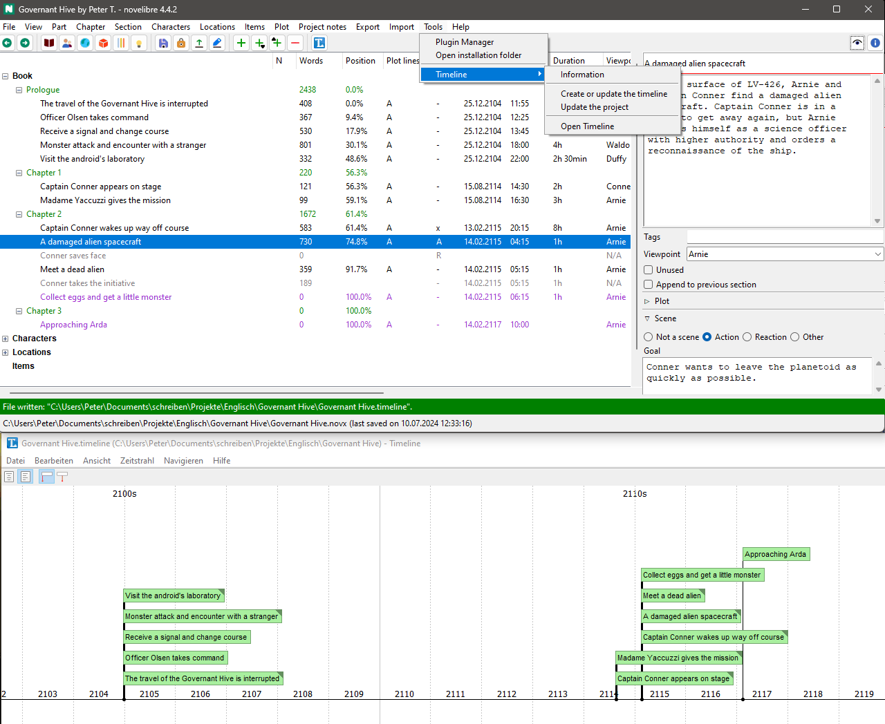

#  nv_timeline

The [novelibre](https://github.com/peter88213/novelibre/) Python program helps authors organize novels.  

The *nv_timeline* plugin synchronizes novelibre projects with [Timeline](http://thetimelineproj.sourceforge.net/).

The plugin adds a **Timeline** submenu to the *novelibre* **Tools** menu and a 
 button to the toolbar.

## Features

- Create a timeline from a *novelibre* project.
- Create a new *novelibre* project from a timeline.
- Synchronize *novelibre* sections with corresponding timeline events in both directions.
- Open the project timeline with the Timeline application.

## Requirements

- [Timeline 2.4+](https://sourceforge.net/projects/thetimelineproj/). Versions below 2.4 do not support labels, which are necessary for synchronization with *novelibre*.
- [novelibre](https://github.com/peter88213/novelibre/) version 5.0+

## Download and install

### Default: Executable Python zip archive

Download the latest release [nv_timeline_v5.0.0.pyzw](https://github.com/peter88213/nv_timeline/raw/main/dist/nv_timeline_v5.0.0.pyzw)

- Launch *nv_timeline_v5.0.0.pyzw* by double-clicking (Windows/Linux desktop),
- or execute `python nv_timeline_v5.0.0.pyzw` (Windows), resp. `python3 nv_timeline_v5.0.0.pyzw` (Linux) on the command line.

#### Important

Many web browsers recognize the download as an executable file and offer to open it immediately. 
This starts the installation.

However, depending on your security settings, your browser may 
initially  refuse  to download the executable file. 
In this case, your confirmation or an additional action is required. 
If this is not possible, you have the option of downloading 
the zip file. 

### Alternative: Zip file

The package is also available in zip format: [nv_timeline_v5.0.0.zip](https://github.com/peter88213/nv_timeline/raw/main/dist/nv_timeline_v5.0.0.zip)

- Extract the *nv_timeline_v5.0.0* folder from the downloaded zipfile "nv_timeline_v5.0.0.zip".
- Move into this new folder and launch *setup.pyw* by double-clicking (Windows/Linux desktop), 
- or execute `python setup.pyw` (Windows), resp. `python3 setup.pyw` (Linux) on the command line.

---

[Changelog](docs/changelog.md)

## Usage and conventions

See the [online manual](https://peter88213.github.io/nvhelp-en/nv_timeline/)

## Credits

- The logo is made using the free *Pusab* font by Ryoichi Tsunekawa, [Flat-it](http://flat-it.com/).
- The Timeline icon is from the [Timeline](http://thetimelineproj.sourceforge.net/) application, 
  licensed under GPLv3 (see below).

## License

This is Open Source software, and the *nv_timeline* plugin is licensed under GPLv3. See the
[GNU General Public License website](https://www.gnu.org/licenses/gpl-3.0.en.html) for more
details, or consult the [LICENSE](https://github.com/peter88213/nv_timeline/blob/main/LICENSE) file.

 

